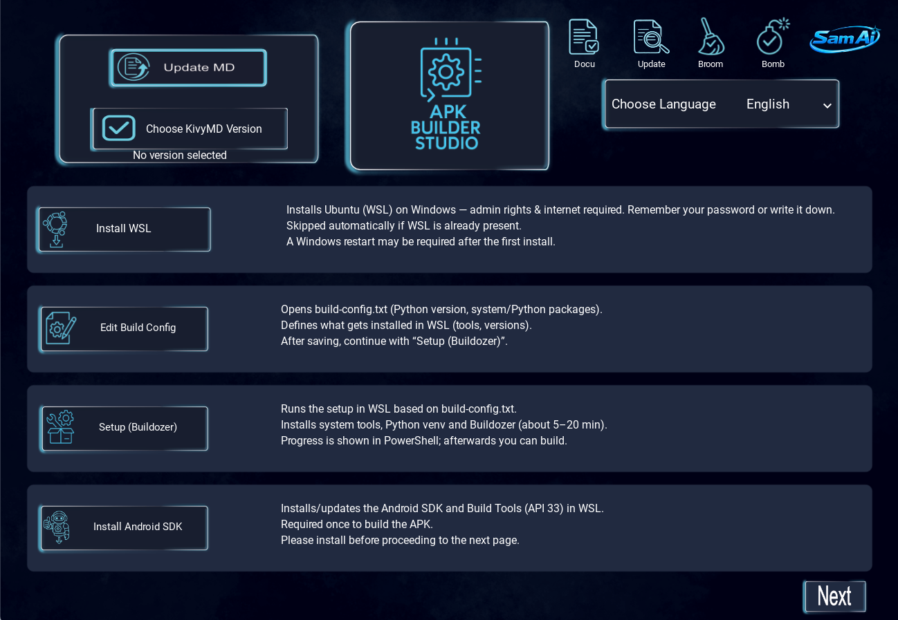
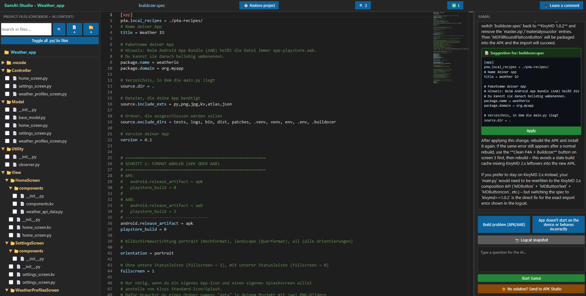

# APK Builder Studio

The fully GUI-driven platform for turning Kivy and KivyMD apps into APKs and AABs — no terminal required.

<a href="https://github.com/PedroHSA0802/apk-builder-studio/releases/download/v1.0.0-beta/setup-apk-builder-studio.exe"><b>⬇ Download (.exe)</b></a>

Security: APK Builder Studio has been submitted to and reviewed by Microsoft Security Intelligence.

Windows may still show an "Unknown publisher" SmartScreen warning when you first run the installer — that's a separate, unrelated prompt caused by the installer not having a paid code-signing certificate, common for independently published apps.

APK Builder Studio sets up the entire Android build environment for you — WSL, Buildozer, the Android SDK/NDK — and walks you through project setup, native modules, builds and on-device debugging with just a few clicks. No terminal, no manual configuration.

## SamAI

When something breaks, the built-in assistant SamAI reads your build log or logcat, finds the cause, and writes the fix straight into your project files — no manual copy-pasting.

### About the SamAI key

SamAI currently requires a free tester key. This isn't about limiting access — it's simply so I can keep support requests manageable while it's still in testing.Grab your key here: [Get your tester key](https://PedroSamuel.pythonanywhere.com/get_beta_key).

To activate: click the SamAI logo in the top right, paste the key with Ctrl+V, and click "OK".

## In my own words

Unlike most software, APK Builder Studio does not log builds, crashes, file contents, or usage data of any kind for the sake of "improving the product." This is a deliberate ethical choice — I don't want to know what you're building or what happens on your machine unless you choose to tell me.

The downside: I have no way of knowing if something breaks for you, or what worked well. So if you run into a bug — whether the build fails, the app crashes on your device, or something in the documentation doesn't match what you see — please let me know, either here on GitHub or in the [Kivy Users Google Group](https://groups.google.com/g/kivy-users), wherever you found your way here from.

And it doesn't have to be a bug report — if a build succeeded, if the Camera/Text Recognition/Speech tutorials worked for you, or if you have suggestions for the documentation, I'd genuinely like to hear about that too.

If you've seen [this thread](https://groups.google.com/g/kivy-users/c/pKjGe1eXkbQ), you know I try to respond and help as quickly as I can.

Leave a comment 
<a href="https://github.com/PedroHSA0802/apk-builder-studio/discussions">https://github.com/PedroHSA0802/apk-builder-studio/discussions</a>

<a href="https://pedrohsa0802.github.io/apk-builder-studio/"><b>Read more about APK Builder Studio</b></a>

